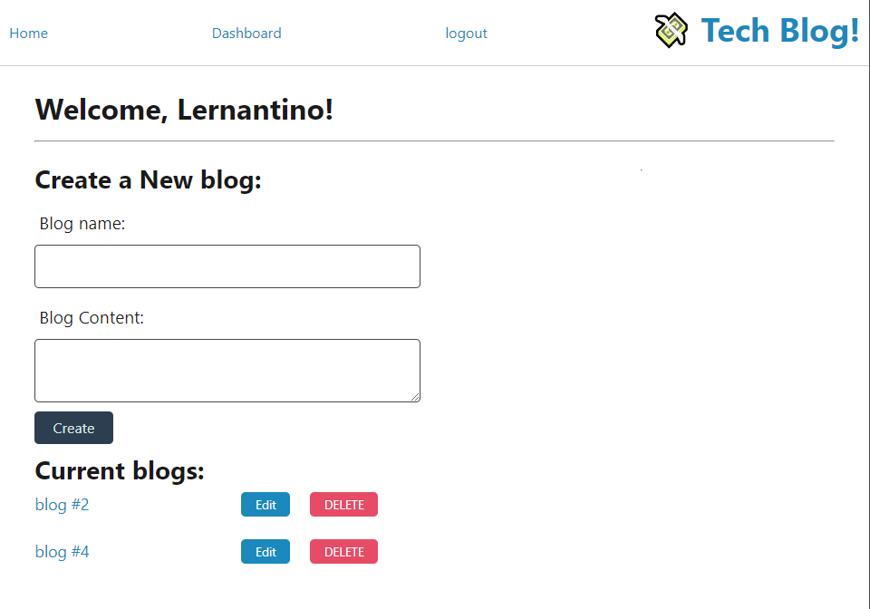
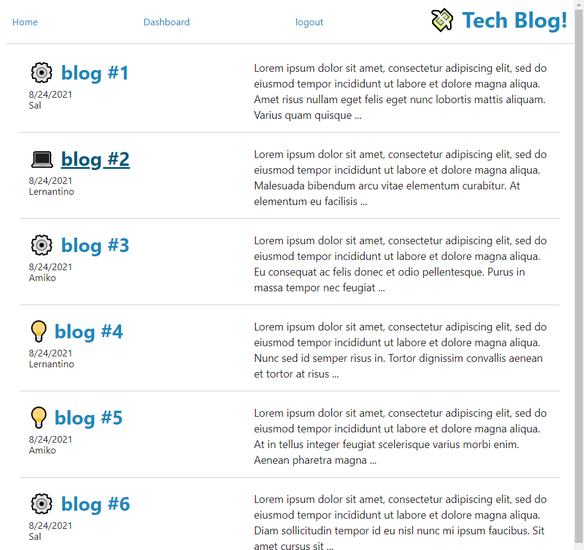

# techBlog
[](https://opensource.org/licenses/MIT)

----
* [Example Deployed App](https://tech-blog-fsf.herokuapp.com/)
----

## Description
An example of a tech bogging platform to illustrate the MVC paradigm. This project is part of the boot camp programming curriculum. 

The styling was based on one of the class exercises. 

## Table of Contents
1. [Description](#description)
2. [Dependencies](#dependencies)
3. [Installation](#installation)
4. [Usage](#Usage)
5. [Contributing](#contributing)
6. [Testing](#testing)
7. [License](#License)
8. [Contact](#Questions)

## Dependencies
This tech bog relies on node, npm and a mysql connection

## Installation
```
git clone git@github.com:macoovacany/techBlog.git
 // set up the .env file to connect to mysql
npm install
npm run seed
npm start
```

## Usage
Features

* adding a user

* user login and logout, with automatic logout after a set period of time.

* adding, deleting and editing blogs

* adding comments to blogs


## Screenshots






## License
The MIT License

## Contributing
This is assignment. Don't bother trying to contribute.
## Testing
no testing

## Questions
Created by macoovacany, contact me directly macoovacany@hotmail.com with any questions.

